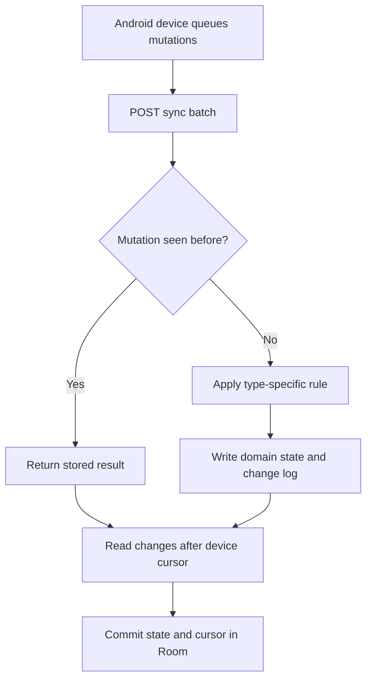

# Merqadyn API

Merqadyn is an offline-first merchant operations platform built with Kotlin, Spring Boot, and PostgreSQL. Store devices can record catalog and inventory work without a connection, submit mutations later, and pull an ordered stream of server changes using a durable cursor.

The repository includes the API, database migrations, synchronization engine, operations dashboard, automated tests, Docker environment, CI, CodeQL scanning, and the contract intended for the companion Android application.

## What the project demonstrates

- Idempotent mutation processing with device-generated UUIDs
- Cursor-based incremental synchronization
- Optimistic product versions and deterministic conflict handling
- Commutative stock adjustments that remain safe after reconnecting
- An append-only change log and conflict audit history
- Merchant, location, device, product, inventory, and movement boundaries
- PostgreSQL migrations with Flyway
- Stateless HTTP Basic authentication for write operations
- Health checks, Prometheus metrics, Docker Compose, CI, and CodeQL
- Integration tests for duplicate mutations and stale product updates

## How synchronization works



Stock adjustments are deltas, so separate devices can contribute changes without replacing each other's counts. Product edits carry a `baseVersion`. When that version is stale, Merqadyn keeps the current server record, writes a conflict audit entry, and tells the device to pull before retrying.

## Technology

| Area | Choice |
|---|---|
| Language | Kotlin 2.3.21 on Java 21 |
| Application | Spring Boot 4.1, Spring MVC, Spring Data JPA |
| Data | PostgreSQL 17, Flyway |
| Security | Spring Security, stateless HTTP Basic for writes |
| Observability | Actuator, Prometheus metrics |
| Delivery | Gradle, Docker, Docker Compose, GitHub Actions |
| Verification | JUnit 5, Spring Boot Test, H2 PostgreSQL mode, CodeQL |

## Run with Docker Desktop

Requirements:

- Docker Desktop with Linux containers enabled
- Git
- Ports `8080` and `5432` available

From PowerShell:

```powershell
git clone https://github.com/oranegonzales/merqadyn-api.git
cd merqadyn-api
Copy-Item .env.example .env
notepad .env
docker compose up --build
```

Replace both example passwords in `.env` before exposing the application outside your computer.

Open:

- Dashboard: `http://localhost:8080`
- Health: `http://localhost:8080/actuator/health`
- Prometheus metrics: `http://localhost:8080/actuator/prometheus`

The first start creates the database and loads the Northline Market demonstration merchant with three Jamaican locations, five products, inventory rows, registered Android devices, and an initial change log.

Stop the services with:

```powershell
docker compose down
```

Add `-v` only when you intentionally want to delete the local PostgreSQL volume and its data:

```powershell
docker compose down -v
```

## Run from IntelliJ IDEA

1. Start PostgreSQL with `docker compose up postgres`.
2. Open the repository as a Gradle project.
3. Select Java 21 as the project SDK.
4. Run `MerqadynApiApplication.kt`.
5. Keep the default database values or set the environment variables listed below.

## Configuration

| Variable | Default | Purpose |
|---|---|---|
| `DATABASE_URL` | `jdbc:postgresql://localhost:5432/merqadyn` | JDBC connection URL |
| `DATABASE_USER` | `merqadyn` | PostgreSQL user |
| `DATABASE_PASSWORD` | `merqadyn` | PostgreSQL password |
| `MERQADYN_ADMIN_USER` | `merqadyn` | Username for write operations |
| `MERQADYN_ADMIN_PASSWORD` | `change-me` | Password for write operations |
| `MERQADYN_DEMO_MERCHANT_ID` | `11111111-1111-4111-8111-111111111111` | Merchant displayed by the bundled dashboard |

All `GET` routes are readable for the portfolio dashboard. `POST` routes require HTTP Basic authentication.

## API surface

The seeded merchant ID is `11111111-1111-4111-8111-111111111111`.

| Method | Route | Purpose |
|---|---|---|
| `GET` | `/api/v1/config` | Merchant selected for the bundled dashboard |
| `GET` | `/api/v1/merchants/{merchantId}/overview` | Dashboard summary and recent activity |
| `GET` | `/api/v1/merchants/{merchantId}/products` | Merchant catalog |
| `POST` | `/api/v1/merchants/{merchantId}/products` | Create a product |
| `GET` | `/api/v1/merchants/{merchantId}/inventory` | Reconciled inventory, optionally filtered by `locationId` |
| `GET` | `/api/v1/merchants/{merchantId}/sync/changes?after=0&limit=100` | Ordered changes after a cursor |
| `POST` | `/api/v1/merchants/{merchantId}/sync/batches` | Submit offline mutations and pull changes |

### Submit an offline stock adjustment

The seeded HWT device ID is `55555555-5555-4555-8555-555555555551`. The seeded bread product ID is `33333333-3333-4333-8333-333333333331`.

```powershell
$merchant = "11111111-1111-4111-8111-111111111111"
$credential = [Convert]::ToBase64String([Text.Encoding]::ASCII.GetBytes("merqadyn:change-me"))
$headers = @{ Authorization = "Basic $credential" }
$body = @{
  deviceId = "55555555-5555-4555-8555-555555555551"
  lastPulledCursor = 0
  mutations = @(
    @{
      mutationId = [guid]::NewGuid().ToString()
      type = "ADJUST_STOCK"
      entityId = "33333333-3333-4333-8333-333333333331"
      payload = @{
        locationId = "22222222-2222-4222-8222-222222222221"
        delta = 3
        reason = "Receiving count completed offline"
      }
    }
  )
} | ConvertTo-Json -Depth 6

Invoke-RestMethod `
  -Method Post `
  -Uri "http://localhost:8080/api/v1/merchants/$merchant/sync/batches" `
  -Headers $headers `
  -ContentType "application/json" `
  -Body $body
```

Submitting the exact same `mutationId` again returns the stored result and does not adjust stock twice.

## Mutation rules

| Mutation | Required fields | Resolution |
|---|---|---|
| `CREATE_PRODUCT` | Product payload; optional client UUID | Reject duplicate SKU |
| `UPDATE_PRODUCT` | Product UUID, `baseVersion`, changed fields | Server retains current record when the version is stale |
| `ADJUST_STOCK` | Product UUID, location UUID, numeric delta | Apply once; reject zero or negative resulting stock |

The detailed mobile contract is in [docs/offline-sync-contract.md](docs/offline-sync-contract.md).

## Tests

```powershell
./gradlew.bat clean test bootJar --no-build-cache
```

The test suite checks application startup, conflict policy, idempotent stock replays, and stale product conflict recording. CI also validates the Compose file. CodeQL uses a clean uncached compilation so Kotlin source is always observed during analysis.

## Repository structure

```text
src/main/kotlin/dev/merqadyn/api
├── api          HTTP contracts, validation, and error responses
├── catalog      Product persistence and version rules
├── config       Stateless write security
├── dashboard    Read model for the operations page
├── inventory    Inventory balances and stock movements
├── merchant     Merchants, locations, and devices
└── sync         Mutation deduplication, conflicts, and change cursors
```

## Companion application

`merqadyn-mobile` is the next repository in the portfolio roadmap. It will use Jetpack Compose, Room, and WorkManager to queue mutations locally and consume this API's sync contract.

## License

Licensed under the MIT License. See [LICENSE](LICENSE).
