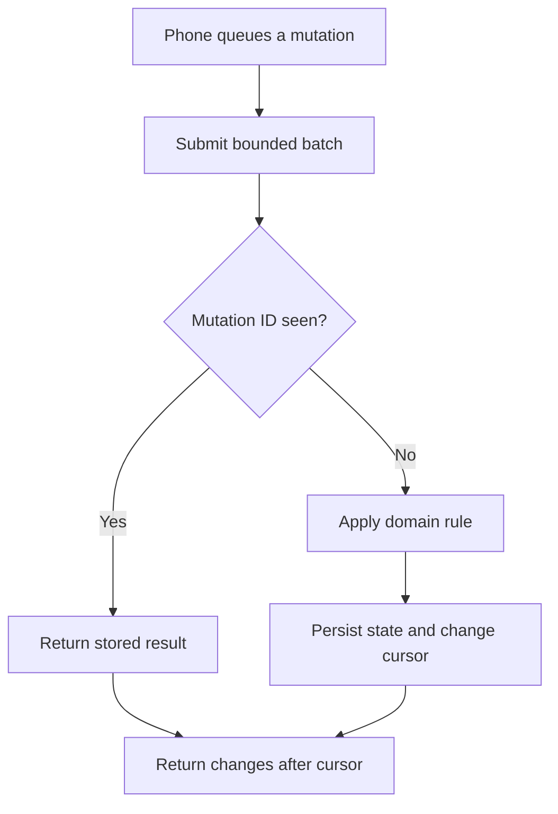

# Merqadyn API

Merqadyn is a horizontally scalable merchant inventory and offline synchronization service. Kotlin and Spring Boot expose a stateless API; PostgreSQL owns durable business state; Redis coordinates rate limits across application instances; Flyway manages the schema; and the bundled website presents a deliberately limited public read model.

## What it demonstrates

- idempotent device mutations with durable UUID deduplication
- cursor-based incremental synchronization and deterministic conflicts
- one-time phone enrollment and device-scoped authentication
- bounded request bodies, write quotas, pagination, and connection pooling
- indexed PostgreSQL access paths and aggregate dashboard queries
- stateless application instances suitable for load balancing
- non-root, read-only application containers with dropped capabilities
- health probes, Prometheus metrics, CI, CodeQL, and integration tests

## Synchronization



Stock changes are deltas. Product edits carry a base version. Replayed mutation IDs return the prior result, while stale product versions become retained conflicts rather than silent overwrites.

## Run on Windows

Requirements are Docker Desktop using Linux containers and Git. PostgreSQL is internal to the Compose network; only application port 8080 is published.

```powershell
git clone https://github.com/oranegonzales/merqadyn-api.git merqadyn-api
cd merqadyn-api
powershell -ExecutionPolicy Bypass -File .\scripts\start-local.ps1 -Detach
curl.exe http://127.0.0.1:8080/actuator/health
```

Open `http://localhost:8080`. The launcher verifies Docker, creates `.env` with unique local passwords, builds PostgreSQL, Redis, and the application, and waits for health.

If Docker reports a missing `dockerDesktopLinuxEngine` named pipe, open Docker Desktop and wait for the Linux engine, or run:

```powershell
docker desktop start --timeout 120
docker info
```

Stop without deleting data:

```powershell
docker compose down
```

`docker compose down --volumes` intentionally deletes the local database volume.

## Connect the Android app

The companion [Merqadyn Mobile](https://github.com/oranegonzales/merqadyn-mobile) setup helper authenticates from the developer's computer and requests a 10-minute enrollment code. The phone redeems that code once for a random, device-scoped token; the administrator password is never built into the APK.

```powershell
cd ..\merqadyn-mobile
.\scripts\configure-local.ps1 -Target UsbPhone
.\gradlew.bat installDebug
```

## API access

Only health, static assets, public configuration, the public overview, and enrollment redemption are anonymous. Private merchant reads accept administrator Basic auth or device headers. Administrative writes require Basic auth. Sync accepts an administrator or the matching enrolled device.

| Method | Route | Access |
| --- | --- | --- |
| `GET` | `/api/v1/public/overview` | Public, privacy-limited and edge-cacheable |
| `POST` | `/api/v1/device-enrollments/redeem` | Public, rate-limited, one-time code required |
| `POST` | `/api/v1/merchants/{merchantId}/devices/{deviceId}/enrollment` | Administrator |
| `DELETE` | `/api/v1/merchants/{merchantId}/devices/{deviceId}/credential` | Administrator or that device |
| `GET` | `/api/v1/merchants/{merchantId}/context` | Administrator or matching device |
| `GET` | `/api/v1/merchants/{merchantId}/products/page?page=0&size=200` | Administrator or matching device |
| `GET` | `/api/v1/merchants/{merchantId}/inventory/page?page=0&size=200` | Administrator or matching device |
| `GET` | `/api/v1/merchants/{merchantId}/sync/changes?after=0&limit=100` | Administrator or matching device |
| `POST` | `/api/v1/merchants/{merchantId}/sync/batches` | Administrator or the same device ID |

Device requests send `X-Merqadyn-Device-Id` and `X-Merqadyn-Device-Token`. Legacy list endpoints remain available but return at most 200 rows.

## Configuration

| Variable | Purpose | Compose value |
| --- | --- | --- |
| `DATABASE_URL` | JDBC URL | internal PostgreSQL service |
| `DATABASE_USER` / `DATABASE_PASSWORD` | Database credential | generated/local `.env` |
| `DATABASE_POOL_MAX_SIZE` | Maximum connections per instance | `20` |
| `DATABASE_POOL_MIN_IDLE` | Warm idle connections per instance | `5` |
| `REDIS_URL` | Shared quota store | internal Redis service |
| `RATE_LIMIT_BACKEND` | `redis` for multi-instance deployment; `memory` for tests | `redis` |
| `MERQADYN_ADMIN_USER` / `MERQADYN_ADMIN_PASSWORD` | Administrator credential | generated/local `.env` |
| `MERQADYN_DEMO_MERCHANT_ID` | Merchant used by the public website | seeded merchant |

The administrator password must be at least 20 characters. Never commit `.env` or deploy the example values.

## Verification

```powershell
.\gradlew.bat clean test bootJar --no-build-cache
docker compose config --quiet
docker compose up --build --wait --wait-timeout 180
curl.exe http://127.0.0.1:8080/actuator/health
```

CI performs these checks against PostgreSQL and Redis. CodeQL scans Kotlin/Java source. Successful mobile CI also publishes an installable debug APK artifact.

## Engineering notes

- [Offline sync contract](docs/offline-sync-contract.md)
- [Scaling](docs/scaling.md)
- [Threat model](docs/threat-model.md)
- [Operations runbook](docs/runbook.md)
- [Security policy](SECURITY.md)

## License

Licensed under the MIT License. See [LICENSE](LICENSE).
